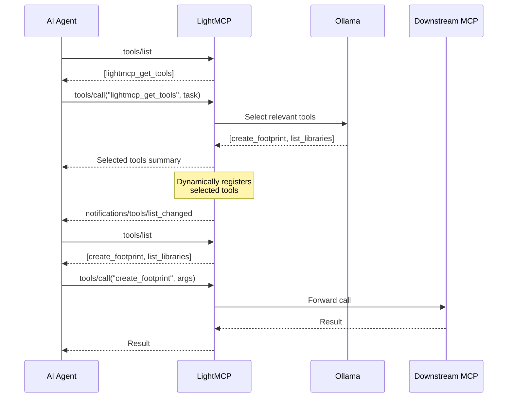
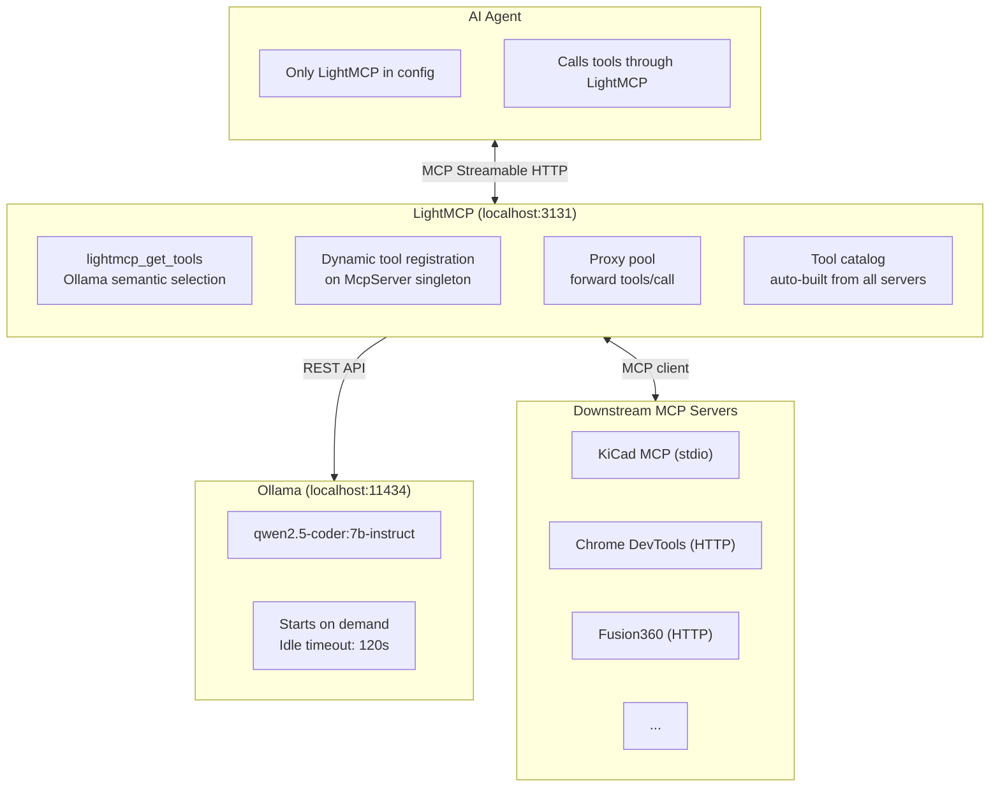

# LightMCP

> **A local LLM-powered semantic tool router for MCP** — bypass the Antigravity's 100-tool limit and reduce context window usage in any MCP-compatible AI agent.

[](LICENSE)
[](https://nodejs.org)
[](https://ollama.com)

---

## The Problem

MCP-compatible agents (like Antigravity) have a hard limit of **100 tools** across all connected servers. With tools like KiCad MCP (137 tools), Chrome DevTools, and Fusion360 active simultaneously, you instantly blow past the limit — and even within it, injecting every tool definition into every conversation wastes thousands of tokens.

## The Solution

LightMCP sits between your AI agent and your MCP servers. It exposes a **single tool** (`lightmcp_get_tools`) that the agent calls with a natural language task description. A local LLM (running via Ollama) reads the full catalog and returns **only the relevant tools** for that task. The selected tools are then **dynamically registered** on LightMCP so the agent can call them — LightMCP transparently forwards each call to the real downstream MCP server.

```
Agent → lightmcp_get_tools("create a KiCad footprint") → [create_footprint, ...]
Agent → tools/list → [create_footprint, get_footprint_info, ...]  (dynamically registered)
Agent → tools/call("create_footprint", {...}) → LightMCP → KiCad MCP → result
```

- **Fully local** — no data sent to external APIs
- **On-demand** — Ollama starts only when needed, shuts down after 2 minutes idle
- **Auto-updating catalog** — watches `mcp_config.json` and rebuilds on change
- **Transparent proxy** — agent calls tools through LightMCP as if they were its own
- **Windows auto-start** — registers via Task Scheduler

---

## Hardware Requirements

| Component | Minimum | Recommended |
|-----------|---------|-------------|
| GPU VRAM  | 6 GB    | 8 GB (RTX 3070 Ti) |
| RAM       | 12 GB   | 16 GB |
| CPU       | Any modern | Intel i5-11600K or better |
| Disk      | 6 GB free | 10 GB free |

The default model (`qwen2.5-coder:7b-instruct` Q4_K_M) uses ~4.5 GB VRAM.

---

## Quick Start

```bash
# 1. Clone and install
git clone https://github.com/NulledNah/LightMCP.git
cd LightMCP
npm install

# 2. Build
npm run build

# 3. Run setup (installs Ollama, pulls model, builds catalog, registers startup)
node dist/cli/index.js setup
# or if globally installed:
lightmcp setup

# 4. Start
lightmcp start
```

Then add to your agent's `mcp_config.json` (e.g. Antigravity's `%USERPROFILE%\.gemini\antigravity\mcp_config.json`):

```json
{
  "mcpServers": {
    "lightmcp": {
      "serverUrl": "http://127.0.0.1:3131/mcp"
    }
  }
}
```

**Important:** Only LightMCP goes in the agent's config. All other MCP servers (KiCad, Chrome DevTools, etc.) are configured in the file pointed to by `mcpConfigPath` in `lightmcp_config.json` (default: auto-detected from the standard Antigravity path). LightMCP reads that file to build its internal tool catalog.

---

## Architecture





---

## CLI Commands

| Command | Description |
|---------|-------------|
| `lightmcp start` | Start the MCP router server |
| `lightmcp build-catalog` | Rebuild tool catalog from all MCP servers |
| `lightmcp build-catalog --active-only` | Only include tools from enabled servers |
| `lightmcp status` | Show status of server, Ollama, and catalog |
| `lightmcp test "<task>"` | Test tool routing locally |
| `lightmcp setup` | Full setup: Ollama + model + catalog + agent config + Windows startup |
| `lightmcp configure` | Re-run AI agent MCP configuration (scan, isolate/add/manual) |

---

## Configuration

Edit `lightmcp_config.json` in the project root:

```json
{
  "server": {
    "port": 3131,
    "host": "127.0.0.1"
  },
  "ollama": {
    "host": "http://127.0.0.1:11434",
    "model": "qwen2.5-coder:7b-instruct",
    "idleTimeoutSeconds": 120,
    "startupTimeoutSeconds": 30,
    "maxRetries": 2
  },
  "catalog": {
    "activeOnly": false,
    "outputPath": "tool_catalog.json",
    "watchMcpConfig": true
  },
  "mcpConfigPath": null
}
```

| Setting | Default | Description |
|---------|---------|-------------|
| `server.port` | `3131` | Port for the MCP HTTP server |
| `server.host` | `127.0.0.1` | Host to bind the server |
| `ollama.host` | `http://127.0.0.1:11434` | Ollama API URL |
| `ollama.model` | `qwen2.5-coder:7b-instruct` | Ollama model for tool selection |
| `ollama.idleTimeoutSeconds` | `120` | Seconds before Ollama is shut down |
| `ollama.startupTimeoutSeconds` | `30` | Max seconds to wait for Ollama to start |
| `ollama.maxRetries` | `2` | Retries on Ollama inference failure |
| `catalog.activeOnly` | `false` | Only include tools from enabled servers |
| `catalog.outputPath` | `tool_catalog.json` | Where to persist the tool catalog |
| `catalog.watchMcpConfig` | `true` | Auto-rebuild catalog on config changes |
| `mcpConfigPath` | auto | Override path to the MCP config listing all servers |

---

## Agent Configuration

During `lightmcp setup`, LightMCP scans your system for compatible AI agents (Antigravity, Claude Code, openCode, Cursor) and offers 3 configuration modes:

| Mode | Behavior |
|------|----------|
| **Isolate** (Recommended) | Saves the full server list to `lightmcp_servers.json`, then rewrites the agent's config with only LightMCP. LightMCP reads the full list via `mcpConfigPath`. Best for minimizing context usage. |
| **Add** | Leaves existing MCP servers untouched, adds LightMCP alongside them. |
| **Manual** | No changes — prints the exact JSON snippet and config path for each detected agent. |

You can re-run configuration anytime with `lightmcp configure`.

Detected agents and their MCP config paths:

| Agent | Config Path |
|-------|------------|
| Antigravity | `~/.gemini/antigravity/mcp_config.json` |
| Claude Code | `~/.claude.json` |
| openCode CLI | `~/.opencode.json` |
| Cursor | `~/.cursor/mcp.json` |

---

## How to Use

Once running, your agent connects only to LightMCP. The full flow:

```
1. Agent calls lightmcp_get_tools("create a KiCad footprint for a JST-SH")
2. Ollama selects: create_footprint, list_footprint_libraries, get_footprint_info
3. LightMCP dynamically registers these 3 tools on its MCP server
4. Agent receives notification, calls tools/list, sees the 3 tools
5. Agent calls create_footprint(...) through LightMCP
6. LightMCP forwards the call to KiCad MCP, returns the result
```

The agent never sees the 137 KiCad tools — only the 3 relevant ones per task. All tool execution happens on the real downstream servers; LightMCP only routes.

---

## Windows Startup Registration

`lightmcp setup` registers a Task Scheduler entry that starts LightMCP at every user login. To manage it manually:

```powershell
# Register (requires admin)
powershell -ExecutionPolicy Bypass -File scripts\setup.ps1 -RegisterTask

# Remove
powershell -ExecutionPolicy Bypass -File scripts\setup.ps1 -UnregisterTask
```

---

## FAQ

**Q: Will the local model send my data anywhere?**  
A: No. Ollama runs entirely locally. No data leaves your machine.

**Q: What if Ollama selects wrong tools?**  
A: LightMCP validates all selected names against the catalog — hallucinated tool names are silently dropped. You can always fall back to manual catalog browsing.

**Q: Can I use a different model?**  
A: Yes — change `ollama.model` in `lightmcp_config.json`. Any Ollama model with reliable JSON output works. `qwen2.5-coder:7b-instruct` is the tested default.

**Q: How long does tool selection take?**  
A: First call: ~3–5s (Ollama startup) + ~1–2s inference. Subsequent calls (while Ollama is warm): ~1–2s.

---

## License

MIT © 2025
