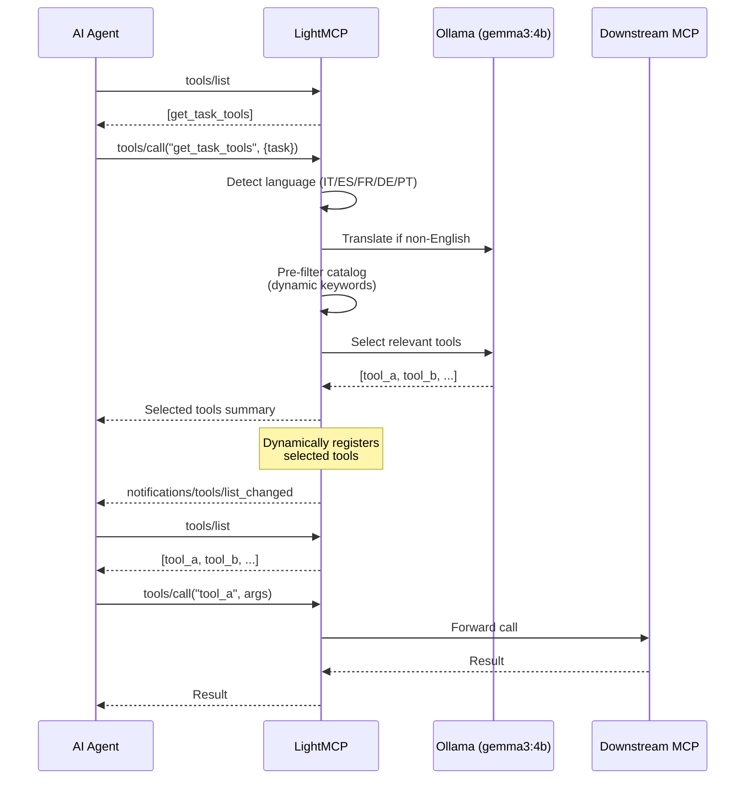
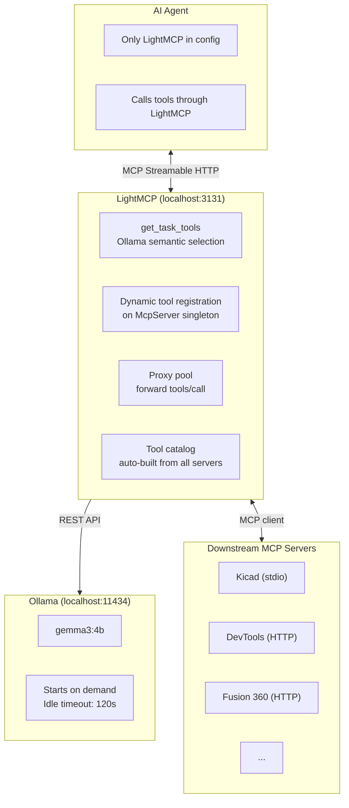

# LightMCP

> **A local LLM-powered semantic tool router for MCP** -- bypass the 100-tool limit and reduce context window usage in any MCP-compatible AI agent.

[](LICENSE)
[](https://nodejs.org)
[](https://ollama.com)
[](https://github.com/NulledNah/LightMCP/releases)

---

## The Problem

MCP-compatible agents (such as Antigravity) typically enforce a maximum of **100 tools** across all connected servers to prevent context window overload. With tools like KiCad MCP (137 tools), Chrome DevTools, and Fusion 360 active simultaneously, the limit is exceeded immediately -- and even within it, injecting every tool definition into every conversation wastes thousands of tokens.

## The Solution

LightMCP sits between your AI agent and your MCP servers. It exposes a **single tool** (`get_task_tools`) that the agent calls with a natural language task description. A local LLM (running via Ollama) reads the full catalog and returns **only the relevant tools** for that task. The selected tools are then **dynamically registered** on LightMCP so the agent can call them -- LightMCP transparently forwards each call to the real downstream MCP server.

```
Agent -> get_task_tools("create a KiCad footprint") -> [create_footprint, ...]
Agent -> tools/list -> [create_footprint, get_footprint_info, ...]  (dynamically registered)
Agent -> tools/call("create_footprint", {...}) -> LightMCP -> KiCad MCP -> result
```

- **Fully local** -- no data sent to external APIs
- **On-demand** -- Ollama starts only when needed, shuts down after idle timeout
- **Auto-updating catalog** -- watches MCP config files and rebuilds on change
- **Transparent proxy** -- agent calls tools through LightMCP as if they were its own
- **Multilingual** -- detects non-English queries and auto-translates them before tool matching (v2: keywords matched against original + translated)
- **Dynamic server discovery** -- no hardcoded server names, keywords generated from actual tool catalogs
- **Server management** -- add, remove, disable, enable MCP servers from the CLI
- **Clean uninstall** -- restores all original agent configurations from backup
- **Cross-platform** -- Windows and Linux with unattended `setup` (winget on Windows, curl on Linux)
- **Hardened** -- rate limiting, CORS, prompt injection guard, path traversal protection, env injection filtering

---

## Hardware Requirements

| Component | Minimum | Recommended |
|-----------|---------|-------------|
| GPU VRAM  | 4 GB    | 6 GB |
| RAM       | 8 GB    | 16 GB |
| CPU       | Any modern | Intel i5-11600K or better |
| Disk      | 4 GB free | 8 GB free |

The recommended model (`gemma3:4b`) uses approximately 2.5 GB VRAM. The previous default (`qwen2.5-coder:7b-instruct`) used 4.5 GB. Any Ollama model with reliable structured JSON output works -- see the FAQ.

---

## Quick Start

```bash
# 1. Clone and install
git clone https://github.com/NulledNah/LightMCP.git
cd LightMCP
npm install

# 2. Build
npm run build

# 3. Run setup (installs Ollama, pulls model, builds catalog, generates tips, configures agents, registers startup)
node dist/cli/index.js setup
# or if globally installed:
lightmcp setup

# 4. Start
lightmcp start
```

`lightmcp setup` handles everything automatically:
1. Checks for Ollama and prints install instructions if missing
2. Pulls the configured model
3. Builds the tool catalog from all downstream MCP servers
4. Generates procedural usage tips for every tool via the local LLM
5. Scans for AI agents and lets you choose which to configure
6. Installs the Antigravity global rule (`~/.gemini/GEMINI.md`) if Antigravity is selected
7. Registers Windows startup via Task Scheduler

### Linux / WSL2

LightMCP is fully functional on Linux and WSL2. The `lightmcp setup` command handles Ollama installation automatically via curl:

```bash
# Full unattended setup (same as Windows)
node dist/cli/index.js setup

# Or manually:
curl -fsSL https://ollama.com/install.sh | sh
ollama pull gemma3:4b
git clone https://github.com/NulledNah/LightMCP.git && cd LightMCP
npm install && npm run build
node dist/cli/index.js build-catalog
node dist/cli/index.js start
```

| Feature | Linux | WSL2 | Windows |
|---------|-------|------|---------|
| `start` / `status` / `test` | YES | YES | YES |
| `build-catalog` | YES | YES | YES |
| `call` / `get-tools` | YES | YES | YES |
| `server` (add/remove/list/disable/enable) | YES | YES | YES |
| `setup` (auto-install Ollama) | YES `curl` | YES `curl` | YES `winget` |
| Startup auto-start | systemd | systemd | Task Scheduler |
| 237 unit/integration tests | YES | YES | YES |

### Client Compatibility

| AI Agent | Status | Transport | Notes |
|----------|--------|-----------|-------|
| **Antigravity** (VS Code) | Working | STDIO bridge via `mcp_config.json` | Fully tested. Handles both English and multilingual queries. |
| **claude\_code** | Ready (pending testing) | HTTP `type: "http"` | Config path: `~/.claude.json`. Uses `http://127.0.0.1:3131/mcp`. |
| **Cursor** | Ready (pending testing) | HTTP `url` | Config path: `~/.cursor/mcp.json`. Uses `http://127.0.0.1:3131/mcp`. |
| **openCode CLI** | Ready (pending testing) | `type: "remote"` + `oauth: false` | Config path: `~/.config/opencode/opencode.json`. v0.4.0 refactored `initialize` for SDK-native Streamable HTTP sessions. Previously blocked by opencode-ai/opencode [issue #8434](https://github.com/anomalyco/opencode/issues/8434). |
| **openCode Desktop** | Ready (pending testing) | `type: "remote"` + `oauth: false` | Same config path as CLI. Uses standard Streamable HTTP sessions now supported in v0.4.0. |

For openCode, the correct config file is `~/.config/opencode/opencode.json`:

```json
{
  "$schema": "https://opencode.ai/config.json",
  "mcp": {
    "lightmcp": {
      "type": "remote",
      "url": "http://127.0.0.1:3131/mcp",
      "enabled": true,
      "oauth": false,
      "timeout": 30000
    }
  }
}
```

### Manual agent configuration

If you skipped agent configuration during setup, add LightMCP to your agent's `mcp_config.json`. For Antigravity (stdio bridge):

```json
{
  "mcpServers": {
    "lightmcp": {
      "command": "node",
      "args": ["<path-to-LightMCP>/dist/server/bridge.js"]
    }
  }
}
```

For agents that support HTTP (Claude Code, Cursor, openCode):

```json
{
  "mcpServers": {
    "lightmcp": {
      "serverUrl": "http://127.0.0.1:3131/mcp"
    }
  }
}
```

**Important:** Only LightMCP goes in the agent's config. All other MCP servers are managed by LightMCP's own `lightmcp_config.json`. When using **isolate** mode (recommended), servers are automatically copied to LightMCP's inline `mcpServers` alongside a backup saved for uninstall restoration.

### Generate tips (optional, already done by setup)

```bash
# Generate procedural usage tips for all tools
lightmcp generate-tips

# Or for a specific server
lightmcp generate-tips --server autodesk-fusion

# Rebuild catalog to inject tips
lightmcp build-catalog
```

---

## Architecture





LightMCP exposes a single `get_task_tools` endpoint. The agent calls it with a task description in any language. LightMCP auto-detects and translates non-English queries via Ollama, pre-filters the catalog by domain keywords dynamically extracted from the actual server tools, and sends only the relevant subset for semantic tool selection.

---

## CLI Commands

| Command | Description |
|---------|-------------|
| `lightmcp start` | Start the MCP router server |
| `lightmcp build-catalog` | Rebuild tool catalog from all MCP servers |
| `lightmcp build-catalog --active-only` | Only include tools from enabled servers |
| `lightmcp status` | Show status of server, Ollama, and catalog |
| `lightmcp test "<task>"` | Test tool routing locally |
| `lightmcp get-tools "<task>"` | Discover relevant tools for a task via semantic LLM selection (multilingual) |
| `lightmcp call <tool> [args...]` | Call a tool through LightMCP (forwards to downstream MCP server) |
| `lightmcp call <tool> --file <path>` | Call a tool with arguments from a JSON file |
| `lightmcp call <tool> --output <path>` | Auto-decode base64 image results to a file |
| `lightmcp generate-tips` | Generate procedural usage tips for each tool via local LLM |
| `lightmcp generate-tips --server <key>` | Generate tips for a specific server only |
| `lightmcp setup` | Full setup: Ollama + model + catalog + agent config + Windows startup |
| `lightmcp configure` | Re-run AI agent MCP configuration (scan, isolate/add/manual) |
| `lightmcp server list` | List all configured MCP servers |
| `lightmcp server list --all` | List all servers including disabled |
| `lightmcp server add <name>` | Add a new MCP server to LightMCP |
| `lightmcp server remove <name>` | Remove a server (auto-rebuilds catalog) |
| `lightmcp server disable <name>` | Disable a server without removing its config |
| `lightmcp server enable <name>` | Re-enable a previously disabled server |
| `lightmcp uninstall` | Restore all agent configs from backup and clean up |

---

## Configuration

Edit `lightmcp_config.json` in the project root:

```json
{
  "server": {
    "port": 3131,
    "host": "127.0.0.1",
    "idleTimeoutSeconds": 0
  },
  "ollama": {
    "host": "http://127.0.0.1:11434",
    "model": "gemma3:4b",
    "idleTimeoutSeconds": 120,
    "startupTimeoutSeconds": 30,
    "maxRetries": 2
  },
  "catalog": {
    "activeOnly": false,
    "outputPath": "tool_catalog.json",
    "watchMcpConfig": true
  },
  "mcpConfigPath": null,
  "mcpConfigPaths": [],
  "mcpServers": {}
}
```

| Setting | Default | Description |
|---------|---------|-------------|
| `server.port` | `3131` | Port for the MCP HTTP server |
| `server.host` | `127.0.0.1` | Host to bind the server |
| `server.idleTimeoutSeconds` | `0` | Seconds before server auto-shuts down (0 = never) |
| `ollama.host` | `http://127.0.0.1:11434` | Ollama API URL |
| `ollama.model` | `gemma3:4b` | Ollama model for tool selection and translation |
| `ollama.idleTimeoutSeconds` | `120` | Seconds before Ollama is shut down |
| `ollama.startupTimeoutSeconds` | `30` | Max seconds to wait for Ollama to start |
| `ollama.maxRetries` | `2` | Retries on Ollama inference failure |
| `catalog.activeOnly` | `false` | Only include tools from enabled servers |
| `catalog.outputPath` | `tool_catalog.json` | Where to persist the tool catalog |
| `catalog.watchMcpConfig` | `true` | Auto-rebuild catalog on config changes |
| `mcpConfigPath` | null | Legacy field (deprecated) — auto-normalized into `mcpConfigPaths` on load |
| `mcpConfigPaths` | `[]` | Array of agent MCP config file paths (replaces JSON-encoded `mcpConfigPath`) |
| `mcpServers` | `{}` | Inline MCP server definitions. Populated automatically by isolate mode. |

### Inline server configuration

You can define servers directly in `lightmcp_config.json` under `mcpServers`. This is the preferred method -- servers configured here are available for catalog building without external files.

```json
{
  "mcpServers": {
    "kicad": {
      "command": "node",
      "args": ["/path/to/KiCAD-MCP-Server/dist/index.js"],
      "env": { "KICAD_PYTHON": "/path/to/python.exe" },
      "disabledTools": ["tool_a", "tool_b"]
    },
    "my-api-server": {
      "serverUrl": "http://127.0.0.1:8080/mcp",
      "disabled": false
    }
  }
}
```

The `mcpServers` schema supports: `command`, `args`, `env`, `serverUrl`, `disabled`, and `disabledTools` per server. The `lightmcp` key is reserved for the bridge entry; it is automatically skipped during catalog building.

---

## Agent Configuration

During `lightmcp setup`, LightMCP scans your system for compatible AI agents (Antigravity, Claude Code, openCode, Cursor) and offers 3 configuration modes:

| Mode | Behavior |
|------|----------|
| **Isolate** (Recommended) | Copies all real servers to LightMCP's inline `mcpServers` and saves a backup to `lightmcp_servers.json` (for uninstall restoration). Rewrites the agent's config with only the LightMCP bridge. Best for minimizing context usage. |
| **Add** | Leaves existing MCP servers untouched, adds LightMCP alongside them. |
| **Manual** | No changes -- prints the exact JSON snippet and config path for each detected agent. |

You can re-run configuration anytime with `lightmcp configure`.

### Uninstall

`lightmcp uninstall` restores all original agent configurations from their `lightmcp_servers.json` backups. Servers explicitly deleted via `lightmcp server remove` are marked as removed and are not restored during uninstall.

Detected agents and their MCP config paths:

| Agent | Config Path |
|-------|------------|
| Antigravity | `~/.gemini/antigravity/mcp_config.json` or `%APPDATA%\Code\User\globalStorage\google.antigravity\mcp_config.json` (Windows) or `~/.config/Code/User/globalStorage/google.antigravity/mcp_config.json` (Linux) |
| Claude Code | `~/.claude.json` |
| openCode CLI | `~/.config/opencode/opencode.json` |
| openCode Desktop | `~/.config/opencode/opencode.json` (shared with CLI) |
| Cursor | `~/.cursor/mcp.json` |

---

## How to Use

Once running, your agent connects only to LightMCP:

```
1. Agent calls get_task_tools("crea una sfera in Autodesk Fusion")
2. Language detected (Italian) -- auto-translated to English via Ollama
3. Domain-aware pre-filter: 169 tools -> 3 Fusion tools
4. Ollama selects: fusion_mcp_execute
5. LightMCP dynamically registers the selected tools on its MCP server
6. Agent calls fusion_mcp_execute via tools/call with Python script arguments
7. Agent calls fusion_mcp_read to verify the result
```

More examples:
```
# KiCad workflow
lightmcp get-tools "create a KiCad footprint for a JST-SH connector"
lightmcp call search_footprints --search_term "JST-SH"
lightmcp call create_footprint --name "JST-SH" --library "Connectors"

# Fusion 360 workflow with --file for complex args
lightmcp get-tools "generate a 10mm cube in Autodesk Fusion"
lightmcp call fusion_mcp_execute --file args.json
lightmcp call fusion_mcp_read --file read_args.json --output screenshot.png

# Chrome DevTools workflow
lightmcp get-tools "debug performance of my landing page"
lightmcp call navigate_page --url "https://mysite.com"
lightmcp call performance_start_trace --reload true
lightmcp call take_screenshot --output landing.png

# Server management
lightmcp server list
lightmcp server disable kicad
lightmcp server enable kicad
```

The agent never sees the full tool list -- only the relevant ones per task. All tool execution happens on the real downstream servers; LightMCP only routes.

---

## Antigravity Global Rule

`lightmcp setup` automatically installs a global rule at `~/.gemini/GEMINI.md` that teaches Antigravity how to use LightMCP:

- Always call `get_task_tools` before any task
- Use `--file` for complex JSON arguments
- The template path is automatically resolved to the actual installation directory

To install manually:
```powershell
$template = Get-Content scripts\antigravity_rule.md -Raw
$geminiMd = "$env:USERPROFILE\.gemini\GEMINI.md"
if (Test-Path $geminiMd) {
  $existing = Get-Content $geminiMd -Raw
  Set-Content $geminiMd ($template.Trim() + "`n`n" + $existing.Trim()) -Encoding utf8
} else {
  New-Item -ItemType Directory -Force -Path "$env:USERPROFILE\.gemini" | Out-Null
  Copy-Item scripts\antigravity_rule.md $geminiMd
}
```

If `~/.gemini/GEMINI.md` already exists, the template is prepended to preserve your existing rules.

---

## FAQ

**Q: Will the local model send my data anywhere?**
A: No. Ollama runs entirely locally. No data leaves your machine.

**Q: What if Ollama selects wrong tools?**
A: LightMCP validates all selected names against the catalog -- hallucinated tool names are silently dropped. You can always fall back to manual catalog browsing.

**Q: What model should I use?**
A: `gemma3:4b` (2.5 GB VRAM) is the recommended default, providing good semantic reasoning for tool selection with lower VRAM usage than the prior default. Any Ollama model with reliable structured JSON output works -- change `ollama.model` in `lightmcp_config.json`.

**Q: How long does tool selection take?**
A: First call: approximately 3-5s (Ollama startup) + 1-2s inference. Subsequent calls (while Ollama is warm): 1-2s. Non-English queries add approximately 0.5s for translation.

**Q: Can I query in languages other than English?**
A: Yes. LightMCP automatically detects Italian, Spanish, French, German, and Portuguese queries and translates them to English before tool matching.

**Q: How do I manage my servers after setup?**
A: Use `lightmcp server list` to see all configured servers. `lightmcp server disable <name>` temporarily disables a server without removing it. `lightmcp server remove <name>` permanently deletes it but preserves the option to restore during uninstall.

---

## License

MIT (c) 2026
