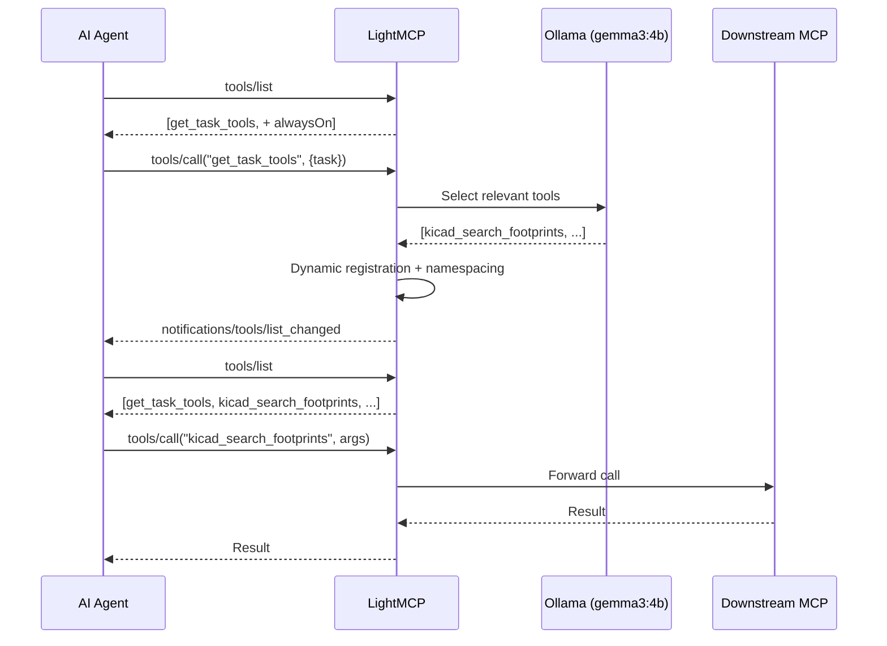

# LightMCP Reference

> Detailed technical documentation. For a quick start, see [README.md](../README.md).

---

## Architecture

LightMCP v0.4.1 uses **per-session isolation** for HTTP and a singleton for STDIO:

```
HTTP mode (lightmcp start):
  SessionRegistry (auto-GC after idle timeout)
  ├── Session A → McpServer → StreamableHTTPServerTransport
  │     ├── registerTool("get_task_tools")
  │     ├── registerTool("_always_on_tool")     ← if configured
  │     └── [dynamic] registerTool("kicad_xxx") ← after get_task_tools
  └── Session B → McpServer → StreamableHTTPServerTransport
        └── ... (fully isolated — no cross-client collisions)

STDIO mode (lightmcp start --stdio):
  McpServer (singleton)
  ├── registerTool("get_task_tools")
  ├── registerTool("_always_on_tool")     ← if configured
  └── [dynamic] registerTool("kicad_xxx") ← after get_task_tools
        ↑
   StdioServerTransport
```

**Two transports, same protocol:**
- **HTTP**: `lightmcp start` → `POST /mcp`, each client gets its own isolated McpServer instance with independent tool registrations. Session GC frees idle sessions automatically.
- **STDIO**: `lightmcp start --stdio` → stdin/stdout JSON-RPC, singleton McpServer, native SDK transport

**Filtered mode** (default): agent sees only `get_task_tools` + `alwaysOn` tools. Calls `get_task_tools("task")` → LLM selects relevant tools → dynamically registers them → `notifications/tools/list_changed`.

**Full mode** (`--mode full`): all tools from all servers exposed with namespacing. No LLM filtering. Maximum MCP compatibility.



---

## CLI Commands

| Command | Description |
|---------|-------------|
| `lightmcp start` | Start the MCP router server (HTTP mode, default) |
| `lightmcp start --stdio` | Start in STDIO mode (for agents that spawn processes) |
| `lightmcp start --mode full` | Start with all tools exposed (no LLM filtering) |
| `lightmcp build-catalog` | Rebuild tool catalog from all MCP servers |
| `lightmcp build-catalog --active-only` | Only include tools from enabled servers |
| `lightmcp status` | Show status of server, Ollama, and catalog |
| `lightmcp test "<task>"` | Test tool routing locally |
| `lightmcp get-tools "<task>"` | Discover relevant tools for a task via semantic LLM selection (multilingual) |
| `lightmcp call <tool> [args...]` | Call a tool through LightMCP (forwards to downstream MCP server) |
| `lightmcp call <tool> --file <path>` | Call a tool with arguments from a JSON file |
| `lightmcp call <tool> --output <path>` | Auto-decode base64 image results to a file |
| `lightmcp generate-tips` | Generate procedural usage tips for each tool via local LLM |
| `lightmcp generate-tips --server <key>` | Generate tips for a specific server only |
| `lightmcp setup` | Full setup: Ollama + model + catalog + agent config + startup auto-start |
| `lightmcp configure` | Re-run AI agent MCP configuration (scan, isolate/add/manual) |
| `lightmcp server list` | List all configured MCP servers |
| `lightmcp server list --all` | List all servers including disabled |
| `lightmcp server add <name>` | Add a new MCP server to LightMCP |
| `lightmcp server remove <name>` | Remove a server (auto-rebuilds catalog) |
| `lightmcp server disable <name>` | Disable a server without removing its config |
| `lightmcp server enable <name>` | Re-enable a previously disabled server |
| `lightmcp uninstall` | Restore all agent configs from backup and clean up |

---

## Configuration Reference

Edit `lightmcp_config.json` in the project root:

```json
{
  "server": {
    "port": 3131,
    "host": "127.0.0.1",
    "idleTimeoutSeconds": 0,
    "mode": "filtered"
  },
  "ollama": {
    "host": "http://127.0.0.1:11434",
    "model": "gemma3:4b",
    "idleTimeoutSeconds": 120,
    "startupTimeoutSeconds": 30,
    "maxRetries": 2
  },
  "catalog": {
    "activeOnly": false,
    "outputPath": "tool_catalog.json",
    "watchMcpConfig": true
  },
  "mcpConfigPath": null,
  "mcpConfigPaths": [],
  "mcpServers": {},
  "alwaysOn": []
}
```

| Setting | Default | Description |
|---------|---------|-------------|
| `server.port` | `3131` | Port for the MCP HTTP server |
| `server.host` | `127.0.0.1` | Host to bind the server |
| `server.idleTimeoutSeconds` | `0` | Seconds before server auto-shuts down (0 = never) |
| `server.mode` | `filtered` | `"filtered"` (LLM selects tools) or `"full"` (all tools exposed with namespacing) |
| `ollama.host` | `http://127.0.0.1:11434` | Ollama API URL |
| `ollama.model` | `gemma3:4b` | Ollama model for tool selection and translation |
| `ollama.idleTimeoutSeconds` | `120` | Seconds before Ollama is shut down |
| `ollama.startupTimeoutSeconds` | `30` | Max seconds to wait for Ollama to start |
| `ollama.maxRetries` | `2` | Retries on Ollama inference failure |
| `catalog.activeOnly` | `false` | Only include tools from enabled servers |
| `catalog.outputPath` | `tool_catalog.json` | Where to persist the tool catalog |
| `catalog.watchMcpConfig` | `true` | Auto-rebuild catalog on config changes |
| `mcpConfigPath` | null | Legacy field (deprecated) — auto-normalized into `mcpConfigPaths` on load |
| `mcpConfigPaths` | `[]` | Array of agent MCP config file paths |
| `mcpServers` | `{}` | Inline MCP server definitions. Populated automatically by isolate mode. |
| `alwaysOn` | `[]` | Tool names always visible to agents without calling `get_task_tools` (e.g., `["system_health"]`) |

### Inline Server Configuration

You can define servers directly in `lightmcp_config.json` under `mcpServers`. This is the preferred method — servers configured here are available for catalog building without external files.

```json
{
  "mcpServers": {
    "kicad": {
      "command": "node",
      "args": ["/path/to/KiCAD-MCP-Server/dist/index.js"],
      "env": { "KICAD_PYTHON": "/path/to/python.exe" },
      "disabledTools": ["tool_a", "tool_b"]
    },
    "my-api-server": {
      "serverUrl": "http://127.0.0.1:8080/mcp",
      "disabled": false
    }
  }
}
```

The `mcpServers` schema supports: `command`, `args`, `env`, `serverUrl`, `disabled`, and `disabledTools` per server. The `lightmcp` key is reserved for the bridge entry; it is automatically skipped during catalog building.

### Server Resolution Cascade

LightMCP discovers downstream MCP servers through multiple sources, in priority order:

1. `$LIGHTMCP_MCP_CONFIG` environment variable
2. Inline `mcpServers` in `lightmcp_config.json`
3. `mcpConfigPaths` — agent config files
4. Auto-detection via scanner (falls back to detected agent configs)
5. Empty fallback (no crash)

---

## Agent Configuration

During `lightmcp setup`, LightMCP scans your system for compatible AI agents and offers 3 configuration modes:

| Mode | Behavior |
|------|----------|
| **Isolate** (Recommended) | Copies all real servers to LightMCP's inline `mcpServers` and saves a backup to `lightmcp_servers.json` (for uninstall restoration). Rewrites the agent's config with only the LightMCP bridge. Best for minimizing context usage. |
| **Add** | Leaves existing MCP servers untouched, adds LightMCP alongside them. |
| **Manual** | No changes — prints the exact JSON snippet and config path for each detected agent. |

You can re-run configuration anytime with `lightmcp configure`.

### Uninstall

`lightmcp uninstall` restores all original agent configurations from their `lightmcp_servers.json` backups. Servers explicitly deleted via `lightmcp server remove` are marked as removed and are not restored during uninstall.

### Detected Agents and Config Paths

| Agent | Config Path |
|-------|------------|
| Antigravity 1.x (legacy IDE) | `~/.gemini/antigravity/mcp_config.json` (standalone) or `%APPDATA%\Code\User\globalStorage\google.antigravity\mcp_config.json` (VS Code extension, Windows) or `~/.config/Code/User/globalStorage/google.antigravity/mcp_config.json` (Linux) |
| Antigravity 2.0 | `~/.gemini/config/mcp_config.json` |
| Claude Code | `~/.claude.json` |
| openCode CLI | `~/.config/opencode/opencode.json` |
| openCode Desktop | `~/.config/opencode/opencode.json` (shared with CLI) |
| Cursor | `~/.cursor/mcp.json` |

---

## Agent Rules

`lightmcp setup` automatically installs mandatory tool discovery rules for all configured AI agents. The rules are wrapped in `<!-- LIGHTMCP_RULE_START -->` / `<!-- LIGHTMCP_RULE_END -->` markers, enabling clean removal during `lightmcp uninstall` — only the LightMCP block is removed, all other user content is preserved.

| Agent | Rule File | Format |
|-------|-----------|--------|
| Antigravity 1.x | `~/.gemini/GEMINI.md` | CLI-based (`lightmcp get-tools`) |
| Antigravity 2.0 | `~/.gemini/GEMINI.md` | CLI-based (`lightmcp get-tools`) |
| Claude Code | `~/.claude/CLAUDE.md` | `get_task_tools` tool call |
| openCode | `~/.config/opencode/AGENTS.md` | `get_task_tools` tool call |
| Cursor | `~/.cursor/rules/lightmcp.mdc` | `get_task_tools` with `alwaysApply: true` |

The rules instruct each agent to:
- Always call `get_task_tools` before any task requiring tools
- Never discover or invoke MCP tools outside LightMCP
- Re-call `get_task_tools` whenever the task changes significantly

To re-apply rules without re-running full setup:
```bash
lightmcp configure
```

---

## How to Use

Once running, your agent connects only to LightMCP:

```
1. Agent calls get_task_tools("crea una sfera in Autodesk Fusion")
2. Language detected (Italian) — auto-translated to English via Ollama
3. Domain-aware pre-filter: 169 tools → 3 Fusion tools
4. Ollama selects: fusion_mcp_execute
5. LightMCP dynamically registers the selected tools with namespaced names
   (e.g. autodesk-fusion_fusion_mcp_execute)
6. Agent calls autodesk-fusion_fusion_mcp_execute via tools/call with Python script arguments
7. Agent calls autodesk-fusion_fusion_mcp_read to verify the result
```

### Examples

```
# KiCad workflow
lightmcp get-tools "create a KiCad footprint for a JST-SH connector"
lightmcp call kicad_search_footprints --search_term "JST-SH"
lightmcp call kicad_create_footprint --name "JST-SH" --library "Connectors"

# Fusion 360 workflow with --file for complex args
lightmcp get-tools "generate a 10mm cube in Autodesk Fusion"
lightmcp call autodesk-fusion_fusion_mcp_execute --file args.json
lightmcp call autodesk-fusion_fusion_mcp_read --file read_args.json --output screenshot.png

# Chrome DevTools workflow
lightmcp get-tools "debug performance of my landing page"
lightmcp call chrome-devtools_navigate_page --url "https://mysite.com"
lightmcp call chrome-devtools_performance_start_trace --reload true
lightmcp call chrome-devtools_take_screenshot --output landing.png

# Server management
lightmcp server list
lightmcp server disable kicad
lightmcp server enable kicad
```

The agent never sees the full tool list — only the relevant ones per task. All tool execution happens on the real downstream servers; LightMCP only routes.

### Generate Tips (optional, already done by setup)

```bash
lightmcp generate-tips                       # all tools
lightmcp generate-tips --server autodesk-fusion  # specific server
lightmcp build-catalog                       # rebuild catalog to inject tips
```

---

## Manual Agent Configuration

If you skipped agent configuration during setup, add LightMCP to your agent's config manually.

For Antigravity (stdio bridge):

```json
{
  "mcpServers": {
    "lightmcp": {
      "command": "node",
      "args": ["<path-to-LightMCP>/dist/server/bridge.js"]
    }
  }
}
```

For agents that support HTTP, the exact config format varies per agent:
- Claude Code: `{ "type": "http", "url": "http://127.0.0.1:3131/mcp" }`
- Cursor: `{ "url": "http://127.0.0.1:3131/mcp" }`
- openCode: `{ "type": "remote", "url": "http://127.0.0.1:3131/mcp", "enabled": true }`

See the [Client Compatibility](#detected-agents-and-config-paths) table for exact config file paths.

**Important:** Only LightMCP goes in the agent's config. All other MCP servers are managed by LightMCP's own `lightmcp_config.json`. When using **isolate** mode (recommended), servers are automatically copied to LightMCP's inline `mcpServers` alongside a backup saved for uninstall restoration.

---

## Hardware Requirements

| Component | Minimum | Recommended |
|-----------|---------|-------------|
| GPU VRAM  | 4 GB    | 6 GB |
| RAM       | 8 GB    | 16 GB |
| CPU       | Any modern | Intel i5-11600K or better |
| Disk      | 4 GB free | 8 GB free |

The recommended model (`gemma3:4b`) uses approximately 2.5 GB VRAM. The previous default (`qwen2.5-coder:7b-instruct`) used 4.5 GB. Any Ollama model with reliable structured JSON output works.

---

## Linux / WSL2

LightMCP is fully functional on Linux (Ubuntu, Fedora, Debian, Arch, etc.) and WSL2.
The `lightmcp setup` command handles Ollama installation automatically and registers a
systemd user service for auto-start (runs in background, no terminal).

```bash
# Full unattended setup (same as Windows)
node dist/cli/index.js setup

# Or manually:
curl -fsSL https://ollama.com/install.sh | sh
ollama pull gemma3:4b
git clone https://github.com/NulledNah/LightMCP.git && cd LightMCP
npm install && npm run build
node dist/cli/index.js build-catalog
node dist/cli/index.js start
```

| Feature | Linux | WSL2 | Windows |
|---------|-------|------|---------|
| `start` / `status` / `test` | YES | YES | YES |
| `build-catalog` | YES | YES | YES |
| `call` / `get-tools` | YES | YES | YES |
| `server` (add/remove/list/disable/enable) | YES | YES | YES |
| `setup` (auto-install Ollama) | YES `curl` | YES `curl` | YES `winget` |
| Startup auto-start | systemd (bg) | systemd (bg) | Task Scheduler (bg) |
| 237 unit/integration tests | YES | YES | YES |

---

## FAQ

**Q: Will the local model send my data anywhere?**
A: No. Ollama runs entirely locally. No data leaves your machine.

**Q: What if Ollama selects wrong tools?**
A: LightMCP validates all selected names against the catalog — hallucinated tool names are silently dropped. You can always fall back to manual catalog browsing.

**Q: What model should I use?**
A: `gemma3:4b` (2.5 GB VRAM) is the recommended default, providing good semantic reasoning for tool selection with lower VRAM usage than the prior default. Any Ollama model with reliable structured JSON output works — change `ollama.model` in `lightmcp_config.json`.

**Q: How long does tool selection take?**
A: First call: approximately 3-5s (Ollama startup) + 1-2s inference. Subsequent calls (while Ollama is warm): 1-2s. Non-English queries add approximately 0.5s for translation.

**Q: Can I query in languages other than English?**
A: Yes. LightMCP automatically detects Italian, Spanish, French, German, and Portuguese queries and translates them to English before tool matching.

**Q: How do I manage my servers after setup?**
A: Use `lightmcp server list` to see all configured servers. `lightmcp server disable <name>` temporarily disables a server without removing it. `lightmcp server remove <name>` permanently deletes it but preserves the option to restore during uninstall.
